<!-- hero: extruded 3d ascii wordmark (wipes in left-to-right, then rocks on
     its vertical axis) above a neofetch-style info card that prints in
     line by line. both panels are 1026px canvases so their edges align.
     wordmark:  WORDMARK_COLS=110 python scripts/make_wordmark_svg.py --mode rock --out wordmark.svg
     info card: python scripts/make_info_card.py -->

<h3><code>kieun@github ~ $ whoami</code></h3>

 
 

 
 

<!-- animated contribution graph: real data, boxes reveal cell by cell
     (regenerated daily by .github/workflows/update-profile-art.yml) -->

<h3><code>kieun@github ~ $ ./contributions.sh</code></h3>

 
 

<h3><code>kieun@github ~ $ ./links.sh</code></h3>

<b>IT Systems Administrator · Automation Builder</b>

 

